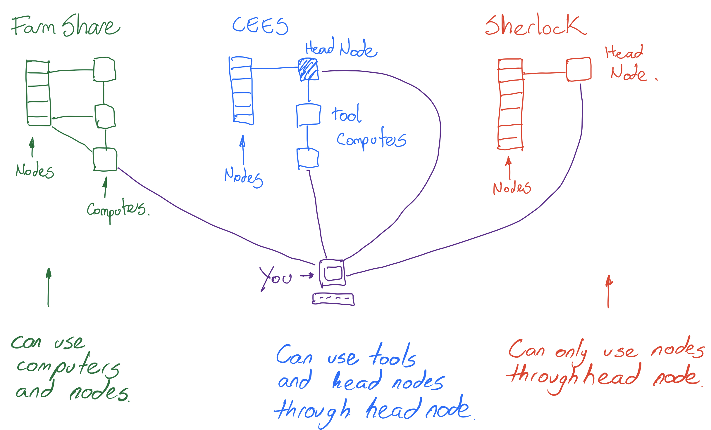
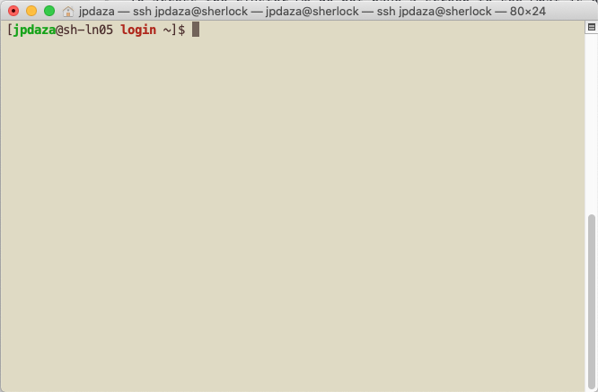

# Using the Cluster from Scratch, Matlab Example
## Goal
Give you the basic steps to submit a job to the computer cluster.
## What is a Cluster?
Many computers connected together that will work for you. Well will explore how to tell them how to work for you.
## Which computer clusters can I use?
* **Sherlock** (Intended for Research work): It is available to all students, as long as a Faculty or PI answers to an email that asks them if you are doing research with them, they will give you an account. It is free to use, Faculty or PI can pay to use more resources . You need to request an account to use it.
* **CEES** (School cluster): Depending on your group you might have access to it. It is not free research groups pay for it. That is why some groups use Sherlock instead. However, it has Tool Computers available to all students.
* **FarmShare** This cluster is available to all students, for class work mainly.


## What you will learn:
* **UNIX**: All interaction with the cluster is based on text, if you want to use a program you write the name and hit enter.
* **Command Based text editors**: We have to create both code and instructions using a text editor, in the command line.
* **Logging in**: Which commands(programs) to run to be able to log in on the cluster.
* **Loading Software**: You have to load the software you want to use.
* **Run a Matlab script from the command line**. This is very Important, as we can only interact via text with the cluster, we have to send commands for it to work. Python, C++, Fortran code, is mostly run from the command line.
* **Sending a Job to the Cluster**: Once you have a stable and reliable code that you know runs well, you do this.

## UNIX
Clusters have their own "language", which is the operating system used to run them which complies with UNIX standard. In our case Mac computers and Linux computers all adhere to the UNIX standard. This in a small part means that we can interact with our computer via text through a **Terminal** window, which in most computers is a program that looks:


Once opened the program looks like this:



The terminal window can be customized to fit your needs.(For more info go to [zshell customized](https://github.com/ohmyzsh/ohmyzsh) or ask me.) Increase text size, change colors, use autocomplete etc...

The terminal is just a screen where we type text and tell the computer what to do, we can use it locally on a Linux or Mac machine, and through it we can connect to another computers and use them, in our case, the cluster. To get a good introduction to using the terminal go to
[Unix1 Shell Intro](https://swcarpentry.github.io/shell-novice/).

### 1. Basic Commands:
The terminal is a window where we type text, that correspond to a program name, hit enter and the command is executed. Old computers did not have a mouse, just the keyboard. We are using good old technology to use the computer cluster, that is why at first it is non-intuitive. It is only text because it is fast communication, and a very small percentage of the world uses it, so there is no business at least for now in creating a graphical interface.

#### Usual format for inputting commands:
Don't worry commands will stick in your head with practice, at first you hit enter and hope you did ok, most of the time you did ok. You write the command name, and sometimes you put options separated with a space.

`command_name -[single letter option]`

Let's see examples.

##### pwd
This first command is a simple program that tells you in which folder are you. The first time you open the terminal or log in a computer you are usually in your home folder.

Type `pwd`.

This will display the home folder.

##### ls
This command lists the files in the current folder.

##### cd
This command changes directories.

##### mkdir
This command makes a directory

##### rm
This command deletes files, use with care, once used files are lost forever or very hard to recover.

There are many more commands, you will learn with practice and looking them up in google. We will practice them now.

### 2. Text files
All code you'll run are text files or were text files at some point. Matlab has a text editor which is nice, but once you want to use a remote computer is better to be familiar with text editors you can use from the command line. This might seem unpractical at first. But remember, you are doing this to save time in programs that can take weeks to run on a regular computer.
#### Why text editors on the command line?
1. You might need to edit your code a bit once you send it to the cluster.
2. You have to write instructions for the cluster.
#### Nano
This is the simplest text editor, we will do our workshop with it.
#### VI
This is the best text editor, don't use for the workshop as you need a good intro to use it. First time I opened it I did not now how to exit. If you want to learn it type the command `vimtutor` in the command line. It will teach you as you go.
### Emacs
This is the most complex.


## WORKSHOP
We have a short time, so we'll do the basics first so that you have the workflow. If we can be on top of that we'll do.

We will do the following:
1. Create a folder to hold our files.
2. Create a file with data.
3. Create a Matlab code to work with that data.
4. Log-in in a remote computer.
5. Send the code to a remote computer and see that we got it there.
6. Run the code(on the remote computer, but not on a cluster node).
7. Get our results back to our local machine.
8. Send the code to a Cluster node. Yes one thing is running it on a remote computer, and another one is to run it on a node.
9. The end.

### 1 - Create a directory/folder.

Open a terminal window. The terminal window opens in you home directory. We will create a folder there.

`mkdir SkillShare`

Hit enter to execute the command. Now let's use `cd` command to move into the folder.

`cd SkillShare`

To check where we are use `pwd`. It should give you all the path to the folder where you are in.

### 2 - Create our data and Matlab script.

Let's create a data file, we'll use the text editor `nano`:

`nano data.txt`

This will open a file `data.txt`, the `^` symbol stands for the Control key. Therefore `^O` stands for `Ctrl+O`. Write the following in the file:

```
1
2
```

To save `^O` hit enter to exit press `^X`, which is `Ctrl + X`.

Good we have our first file. Now, let's create our Matlab script.

`nano matlabScript.m`

Put the following text.

```
data=load('data.txt');
a=data(1);b=data(2);
x=linspace(0,1,100);
y=sin(2*a*pi*x)+sin(2*b*pi*x);
plot(x,y)
print('sine.png','-dpng')
```

Save and exit.

#### Checkpoint
Type `ls` you shoud see the two files we have created.
Type `cat data.txt`, it displays the text inside data.
Type `cat matlabScript.m`, it shows the script.

### 4. Logging in the Cluster we'll use FarmShare
**Open a new terminal window:**
To log in in the cluster we will use a program called `ssh`, which stands for secure shell.

```shell
ssh SUID@rice.stanford.edu
```
We have logged in, it does not look much different than the terminal we used before. If you type `ls` you will see what is in your home directory.

### 5. Sending your files to the cluster.

We have to log in on the cluster to know where to send the files. We need the location in the FarmShare cluster. For this we type:

`pwd`

This outputs the your home directory location in the cluster, we need that. It shoud look like this:

`home/SUID`

In this case was simple, in others the path to your home might be longer. We have two windows, one in our local computer and another one logged in on the cluster.

**Next step: Use the window on the local computer, the one in which you created the files!** To send the files we are going to use a command named `scp` it accepts two arguments a source and a target.

`scp -[options] source target`

First check where we are. `pdw` We should be in the folder where we created the files called `SkillShare`. We are going to send the whole folder. We get out of it.

`cd ..`

This command takes you out of the folder back to your home folder. Now we send the folder.

`scp -r ./SkillShare SUID@rice.stanford.edu:/home/SUID`

The option `-r` stands for recursive, which is a CS way of saying send the whole folder an everything inside. the source is our folder `./`. This is a shortcut to writing the current folder. And the target is the cluster computer, it needs your user name and where in the cluster computer.

#### Checkpoint
Go to the window where you are logged in on the cluster. If you type `ls` the folder `SkillShare` is now there.


### 6 - Running Matlab in the remote Computers
Note: You can only run Matlab this way in FarmShare and the tool computers. Sherlock and CEES cluster require you to do it another way that will explore later.

**Work on the window where you are logged in in the cluster.** Matlab is not loaded by default in the remote machines, we have to tell the machine to load it.

`module load matlab`

Will load Matlab in the computer we logged in, `module load` will load many other programs that you might want to use.

To open Matlab we simply write:

`matlab`

And everything else is just as we practice in our local machine. Matlab will open and we can run our code. Inside Matlab the `cd` command works. If your are not in the SkillShare folder, lets move there.

`cs SkillShare`

Type `ls` to see the files. We can now run our Matlab script, by typing the name `matlabScript`. Quit Matlab by typing `quit`.

#### Checkpoint
After it runs we can see that it produced the file `sine.png`, simply type `ls`. Good you've run your first script in a remote computer.

### 7 - Getting our results back to our local machine.
Here we will use `scp` again. The source in this case is the cluster computer. We will only transfer our results.

```
scp SUID@rice.stanford.edu:/home/SUID/SkillShare/sine.png .
```
Remember `.` stands for the folder you are in, you can change this to any other folder of your preference.

#### Checkpoint
Check that you have the result in your local machine. `ls`. Also go to finder and look for it! Now you can ran Matlab on a remote machine, send your data process it and bring it back.


### 8. Sending a Job to a Cluster Node

**Note: Here your program must run without interaction** Meaning we will not open Matlab, but instead will tell Matlab to run our code. In the case of Matlab this is done with the following command:

```
matlab -batch "matlabScript"
```

The option `-batch` tells Matlab just to run our script. If your Matlab script does not have a line to output results, your will never get them. In our case we print a plot.

**Note: Now we create the instructions for the cluster Manager to execute our Script, it will decide when and how.**

We create this instructions file.

`nano matlabJob.sh`

The `.sh` means that is code that should run in the shell/terminal. The contents of the file should be the following. These are just instructions that let the head Node know what are your computer needs and the code you want to execute.

```
#!/bin/bash -l
#SBATCH -J SUID_job
#SBATCH -N 1
#SBATCH -c 2
#SBATCH -t 00:00:10
#SBATCH -o output.txt
#SBATCH -e errors.txt
#SBATCH --mail-type=ALL
#SBATCH --mail-user=SUID

module load matlab
matlab -batch "matlabScript"
```

Close and save the file. We are now ready to send a job to the cluster, to send a job we just type:

`sbatch matlabJob.sh`

This sends our job to the cluster. To see how our job is doing we type:

`squeue`

You will see the jobs other persons are submitting, we have a name for our job. So lets filter it.

`squeue --name SUID_job`

These are the basics to submit a job to the cluster.
